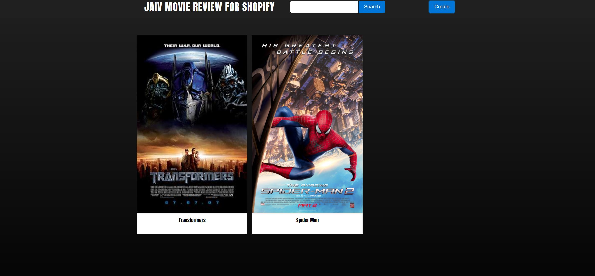
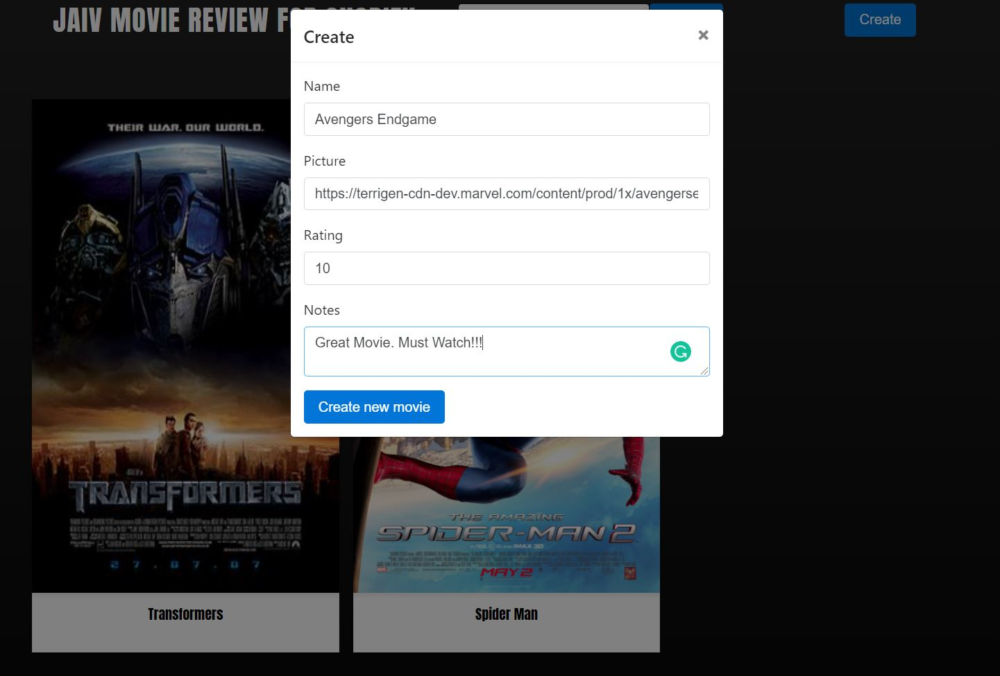
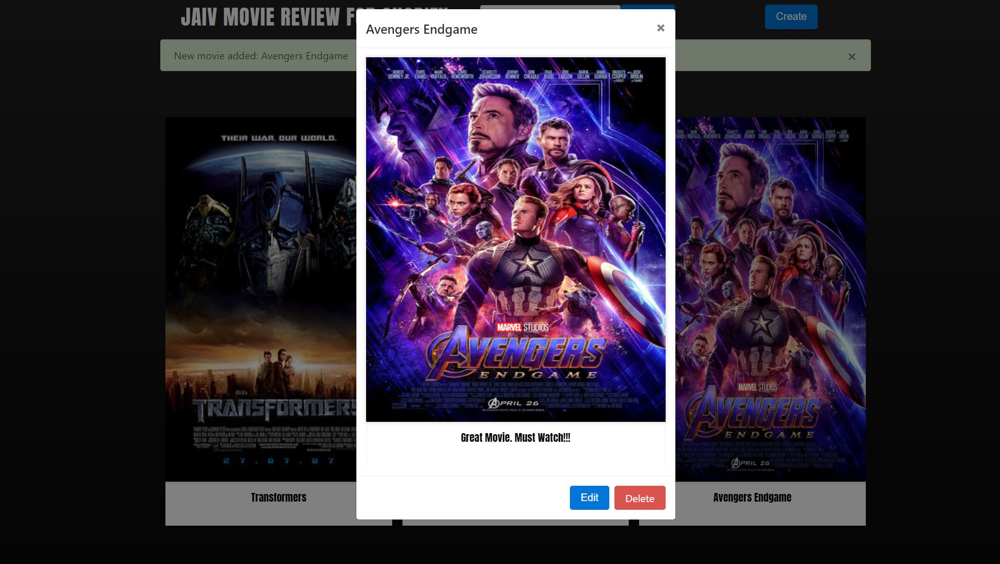
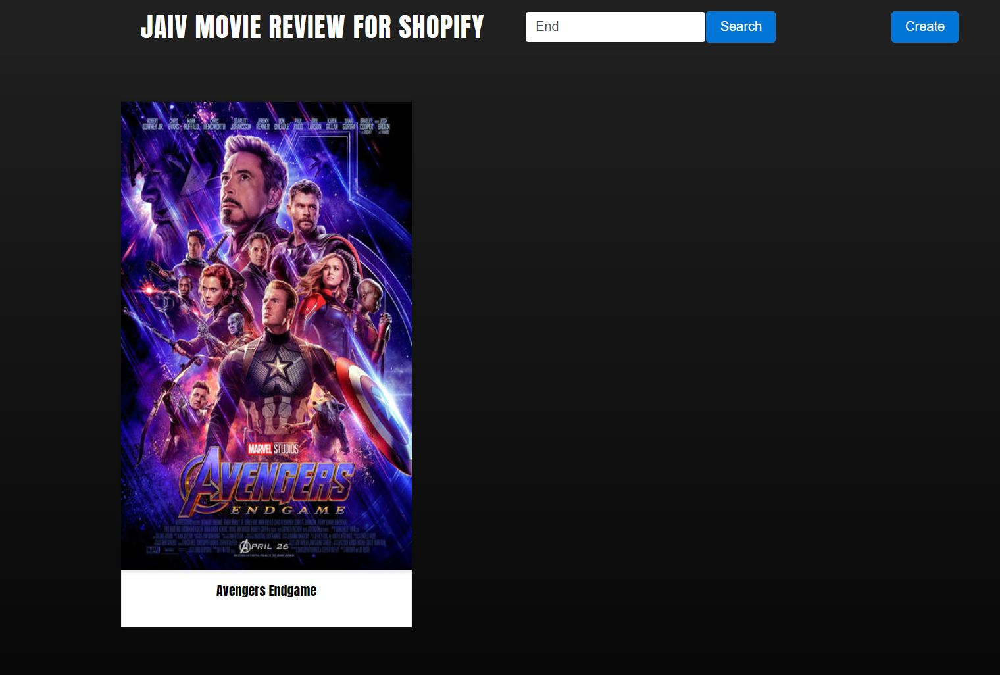

# Movie review Application
This is a project for shopify developer intern challenge. Fall-2021

[Live Preview](https://herokudjangoapp--1.herokuapp.com/)
## Contents

1. [Initial Setup Instructions](#initial-setup-instructions)
1. [Running Server](#running-server)
1. [How to operate app](#steps-to-operate)


## Initial Setup Instructions

### Setup Python Virtual Environment for mac users
```buildoutcfg
python3 -m venv venv
. venv/bin/activate
pip3 install -r requirements.txt
```
### Setup Python Virtual Environment for Windows users
```buildoutcfg
python3 -m venv venv
venv\Scripts\activate
pip3 install -r requirements.txt
```
## Running Server

```buildoutcfg
python mange.py migrate
python mange.py runserver
```
### Go and check `http://127.0.0.1:8000/`
## Steps to Operate

 - Once open the application you will see the following:
    
 - Now press `Create` button to create a new movie review. 
 - Now, add movie `name, Picture (Image Url), Rating and Notes`. Note by adding picture you just need to add the Image URL so just find an online image url and paste it there.
 - A little trick to copy Image URL: Find your image from google images ➡ Right click ➡ Copy Image Address.   
    
 - By pressing the `Create new movie` button you'll see that your movie has been added, and also give a small notification pop-up.
    
 - You can also hover and view your details.
    
 - By pressing `View Details` button you can `edit` or `delete` your movie details. 
    
 - Search any keyword or movie name it will filter and display related results.  
    
